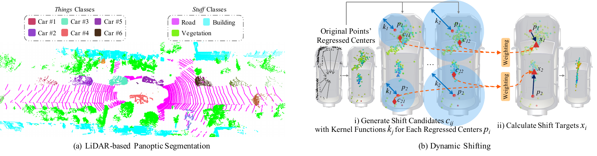
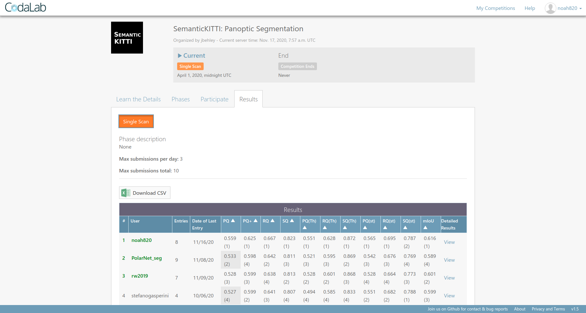

[](https://paperswithcode.com/sota/panoptic-segmentation-on-semantickitti?p=lidar-based-panoptic-segmentation-via-dynamic)

# LiDAR-based Panoptic Segmentation via Dynamic Shifting Network
[[paper]](https://arxiv.org/abs/2011.11964)

## Overview
This repository contains the author's implementation of the work "[LiDAR-based Panoptic Segmentation via Dynamic Shifting Network](https://arxiv.org/abs/2011.11964)".



For further information, please contact [Fangzhou Hong](mailto:fangzhouhong820@gmail.com).

## News
- **2020-12-01** Code release!
- **2020-11-16** We achieve 1st place in [SemanticKITTI Panoptic Segmentation leaderboard](https://competitions.codalab.org/competitions/24025#results).



## Requirements
- easydict
- [hdbscan](https://pypi.org/project/hdbscan/)
- numba
- numpy
- pyyaml
- python=3.7
- scikit-learn
- scipy
- [spconv](https://github.com/traveller59/spconv)=1.1
- tensorboard=2.3.0
- torch=1.5
- torchvision=0.6.0
- [torch-cluster](https://github.com/rusty1s/pytorch_cluster)=1.5.7
- [torch-scatter](https://github.com/rusty1s/pytorch_scatter)=1.3.2
- tqdm

## Data Preparation
Please download the [SemanticKITTI](http://www.semantic-kitti.org/dataset.html#overview) dataset to the folder `data` and the structure of the folder should look like:

```
./
├── 
├── ...
└── data/
    ├──sequences
        ├── 00/           
        │   ├── velodyne/	
        |   |	├── 000000.bin
        |   |	├── 000001.bin
        |   |	└── ...
        │   └── labels/ 
        |       ├── 000000.label
        |       ├── 000001.label
        |       └── ...
        ├── 08/ # for validation
        ├── 11/ # 11-21 for testing
        └── 21/
	        └── ...
```

## Getting Started
The training pipeline of our DS-Net consists of three steps: 1) semantic segmentation training; 2) center regression training; 3) dynamic shifting training. The first two steps give us the backbone model. The last step gives our DS-Net. We provide the corresponding pretrained model of each step. The inferencing and training details are further explained in this section. 

Note that our implementation only supports parallel training for now. We fix the batch size of each GPUs to `1`. In the first line of each script, you could choose the number of GPUs `${ngpu}` you wish to use for training or inferencing. In the second line, you could set the folder name `${tag}` and all the generated files will be put into `./output/${tag}`. All the provided pytorch distributed version of scripts are not tested due to the lack of proper environment. All the slurm version of scripts are tested and should work well. Should there be any problem, feel free to open an issue.

### Pretrained Models
If you wish to use our pretrained models, remember to create a new folder `pretrained_weight` and put all the downloaded models there.
| Step | Download Link                                                |
| ---- | ------------------------------------------------------------ |
| 1    | [sem_pretrain.pth](https://drive.google.com/file/d/1cGieEmsRhVD2YR3CH7TOj5H3y-4WG96q/view?usp=sharing) |
| 2    | [offset_pretrain_pq_0.564.pth](https://drive.google.com/file/d/1pimhJ8iKR518I7g7xLKOB4lLYjQ0Doyp/view?usp=sharing) |
| 3    | [dsnet_pretrain_pq_0.577.pth](https://drive.google.com/file/d/1BZTEZOUfoYvobppuOgO6DC_Hp_c6YytJ/view?usp=sharing) |

### Inferencing with the Pretrained Models
We provide inferencing scripts for the backbone and our DS-Net.

#### Backbone
Our backbone consists of the semantic segmentation module, the center regression module, a heuristic clustering algorithm and the consensus-driven fusion module. You are welcomed to play around with different heuristic algorithms and their parameter settings in `./cfgs/release/backbone.yaml` since we provide several clustering algorithms in `./utils/clustering.py`.

The inferencing scripts of our backbone are `./scripts/release/backbone/val_*.sh`. Before using the scripts, please make sure you have downloaded the pretrained model (of step 2) or put the models trained by yourself (in step 2) to `./pretrained_weight` and make sure to pass the correct path of the model to `--pretrained_ckpt` option.

#### DS-Net
The inferencing scripts of our DS-Net are in `./scripts/release/dsnet`. `val_*.sh` are for inferencing on the validation set of SemanticKITTI. `test_*.sh` are for inferencing on the test set of SemanticKITTI and will generate prediction files under the corresponding output folder. Before using the scripts, remember to download the pretrained model (of step 3) or put the model trained by yourself (in step 3) to `./pretrained_weight` and make sure you pass the right path to `--pretrained_ckpt` option in the scripts.

### Training from Scratch
#### 1. Semantic segmentation training
The training codes and scripts for this step will be released soon. For now, please download the step 1 pretrained model using the above link. Please note that the cylinder backbone used in our implementation is the original version of [Cylinder3D](https://arxiv.org/abs/2008.01550) instead of the [latest version](https://arxiv.org/abs/2011.10033).

#### 2. Center regression training
The training scripts of this step could be found in `./scripts/release/backbone/train_*.sh`. Before using the training scripts, please download the pretrained model of step 1 to folder `./pretrained_weight`. Feel free to play around with different parameter settings in `./cfgs/release/backbone.yaml`.

#### 3. Dynamic shifting training
The training scripts of step 3 could be found in `./scripts/release/dsnet/train_*.sh`. Before using the training scripts of this part, please download the pretrained model (of step 2) to folder `./pretrained_weight` or put the model trained (in step 2) to `./pretrained_weight` and change the `--pretrained_ckpt` option to the correct path. You could experiment with different parameter settings in `./cfgs/release/dsnet.yaml`.

## License

Distributed under the MIT License. See `LICENSE` for more information.

## Citation

If you find our work useful in your research, please consider citing the following papers:

```
@article{hong2020lidar,
  title={LiDAR-based Panoptic Segmentation via Dynamic Shifting Network},
  author={Hong, Fangzhou and Zhou, Hui and Zhu, Xinge and Li, Hongsheng and Liu, Ziwei},
  journal={arXiv preprint arXiv:2011.11964},
  year={2020}
}
```

## Acknowledgments
In our implementation, we refer to the following open-source databases:
- [PolarSeg](https://github.com/edwardzhou130/PolarSeg)
- [spconv](https://github.com/traveller59/spconv)
- [Cylinder3D](https://github.com/xinge008/Cylinder3D)
- [OpenPCDet](https://github.com/open-mmlab/OpenPCDet)